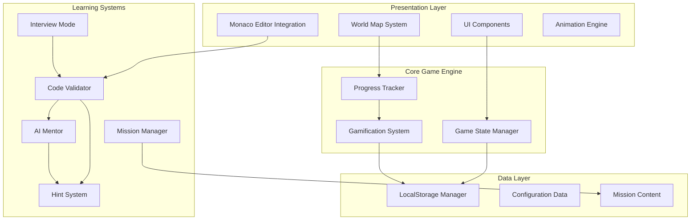
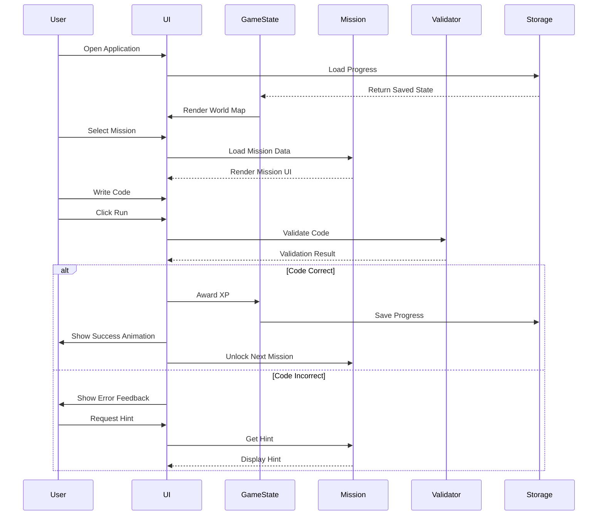

# Design Document: SpringQuest Gamified Learning Platform

## Overview

SpringQuest is a browser-based gamified learning platform that transforms theoretical Java, Spring Boot, and Reactive Programming knowledge into hands-on engineering skills. Built with pure HTML, CSS, and Vanilla JavaScript, it provides an interactive, progression-based learning experience where users solve real-world coding missions using Monaco Editor, with all progress stored locally via LocalStorage. The platform simulates a career progression from Intern to Spring Master through 11 sequential worlds, each focusing on specific technical domains, while incorporating code validation, AI mentorship, interview preparation, and comprehensive gamification mechanics.

## Architecture



## Main Application Flow



## Components and Interfaces

### Component 1: Game State Manager

**Purpose**: Manages the overall game state, player progress, and world unlocking logic

**Interface**:
```javascript
class GameStateManager {
  constructor(storageManager)
  
  // State management
  initializeGame(): GameState
  loadGame(): GameState
  saveGame(state: GameState): void
  
  // Progress tracking
  updateProgress(missionId: string, result: MissionResult): void
  unlockWorld(worldId: string): void
  unlockMission(missionId: string): void
  
  // Player stats
  addXP(amount: number): LevelUpResult
  addCoins(amount: number): void
  updateRank(): Rank
  recordStreak(): void
  
  // Query methods
  getPlayerStats(): PlayerStats
  getUnlockedWorlds(): string[]
  getCompletedMissions(): string[]
  getCurrentLevel(): number
  getCurrentRank(): Rank
}
```

**Responsibilities**:
- Initialize new game or load existing progress
- Track player progression through worlds and missions
- Calculate and award XP, coins, and achievements
- Manage rank promotions and level-ups
- Persist state changes to LocalStorage
- Determine what content is available to the player

### Component 2: Mission Manager

**Purpose**: Loads, validates, and manages individual mission lifecycle

**Interface**:
```javascript
class MissionManager {
  constructor(contentLoader, validator, hintSystem)
  
  // Mission lifecycle
  loadMission(missionId: string): Mission
  startMission(missionId: string): void
  submitCode(code: string): ValidationResult
  completeMission(missionId: string): MissionReward
  
  // Assistance methods
  getHint(missionId: string, attemptCount: number): Hint
  getSolution(missionId: string): string
  getExplanation(missionId: string): string
  
  // Query methods
  getMissionsByWorld(worldId: string): Mission[]
  getMissionProgress(missionId: string): MissionProgress
  getNextMission(currentMissionId: string): Mission | null
}
```

**Responsibilities**:
- Load mission data from configuration
- Provide starter code and mission context
- Coordinate code validation through Validator
- Manage hint progression (3 hints before solution)
- Track attempts and provide appropriate feedback
- Calculate and return mission rewards

### Component 3: Code Validator

**Purpose**: Validates user code against mission requirements using multiple strategies

**Interface**:
```javascript
class CodeValidator {
  constructor(testRunner)
  
  // Validation strategies
  validateSyntax(code: string): SyntaxResult
  validateStructure(code: string, requirements: StructureRequirements): StructureResult
  validateBehavior(code: string, tests: Test[]): TestResult
  validatePerformance(code: string, benchmarks: Benchmark[]): PerformanceResult
  
  // Pattern matching
  checkAnnotations(code: string, required: string[]): AnnotationResult
  checkReturnTypes(code: string, expected: TypeMap): TypeResult
  checkNamingConventions(code: string, conventions: Convention[]): ConventionResult
  checkArchitecture(code: string, pattern: ArchitecturePattern): ArchitectureResult
  
  // Comprehensive validation
  validate(code: string, mission: Mission): ValidationResult
}
```

**Responsibilities**:
- Parse and validate Java/Spring Boot code syntax
- Check for correct annotations (@Controller, @Service, @RestController, etc.)
- Verify correct return types and method signatures
- Validate architectural patterns (Controller-Service-Repository)
- Run hidden and visible test cases
- Check naming conventions and Spring best practices
- Validate Reactive operators usage (Mono/Flux)
- Provide detailed error messages and suggestions

### Component 4: LocalStorage Manager

**Purpose**: Handles all persistence operations using browser LocalStorage


**Interface**:
```javascript
class LocalStorageManager {
  constructor(storageKey: string)
  
  // Core operations
  save(key: string, data: any): void
  load(key: string): any | null
  delete(key: string): void
  clear(): void
  
  // Game-specific operations
  saveGameState(state: GameState): void
  loadGameState(): GameState | null
  savePlayerStats(stats: PlayerStats): void
  loadPlayerStats(): PlayerStats | null
  saveMissionProgress(missionId: string, progress: MissionProgress): void
  loadMissionProgress(missionId: string): MissionProgress | null
  
  // Utility methods
  exists(key: string): boolean
  getStorageSize(): number
  exportData(): string
  importData(jsonData: string): void
}
```

**Responsibilities**:
- Serialize and deserialize game data
- Store player progress, stats, and achievements
- Handle storage quota exceeded errors
- Provide data export/import functionality
- Ensure data integrity with validation

### Component 5: World Map System

**Purpose**: Renders interactive world map with progression visualization


**Interface**:
```javascript
class WorldMapSystem {
  constructor(gameState, renderer)
  
  // Rendering
  render(): void
  renderWorld(world: World): void
  highlightUnlockedWorlds(worldIds: string[]): void
  animateWorldUnlock(worldId: string): void
  
  // Interaction
  onWorldClick(worldId: string, callback: Function): void
  onMissionClick(missionId: string, callback: Function): void
  
  // Navigation
  navigateToWorld(worldId: string): void
  navigateToMission(missionId: string): void
  showWorldDetails(worldId: string): void
  
  // Visual feedback
  showProgressIndicator(worldId: string, completion: number): void
  playUnlockAnimation(worldId: string): void
  updateWorldStatus(worldId: string, status: WorldStatus): void
}
```

**Responsibilities**:
- Render 11 sequential worlds with visual progression
- Display locked/unlocked states with appropriate styling
- Handle click events for world and mission selection
- Animate world unlocks with particle effects
- Show completion percentage for each world
- Provide smooth transitions between map and mission views

### Component 6: Gamification System


**Purpose**: Manages XP, levels, achievements, and progression mechanics

**Interface**:
```javascript
class GamificationSystem {
  constructor(gameState, achievementRegistry)
  
  // XP and Leveling
  awardXP(amount: number, reason: string): LevelUpResult
  calculateLevel(totalXP: number): number
  getXPForNextLevel(currentLevel: number): number
  
  // Coins and Currency
  awardCoins(amount: number, reason: string): void
  spendCoins(amount: number, item: string): boolean
  
  // Achievements
  checkAchievements(action: PlayerAction): Achievement[]
  unlockAchievement(achievementId: string): void
  getAchievementProgress(achievementId: string): number
  
  // Ranks
  calculateRank(stats: PlayerStats): Rank
  checkRankPromotion(): RankPromotion | null
  
  // Streaks
  recordDailyActivity(): StreakResult
  getStreakCount(): number
  resetStreak(): void
  
  // Skill Tree
  unlockSkill(skillId: string): boolean
  isSkillUnlocked(skillId: string): boolean
  getAvailableSkills(): Skill[]
}
```

**Responsibilities**:
- Calculate XP rewards based on mission difficulty and performance
- Manage level-up logic and progression curve
- Track and unlock achievements (first mission, 10 missions, perfect score, etc.)
- Handle rank promotions from Bronze to Legend
- Maintain daily streak tracking
- Manage skill tree unlocks and prerequisites
- Award bonus XP for daily challenges and boss battles

### Component 7: AI Mentor System

**Purpose**: Provides intelligent, context-aware guidance without revealing solutions

**Interface**:
```javascript
class AIMentorSystem {
  constructor(missionData, hintEngine)
  
  // Guidance methods
  provideSocraticHint(code: string, error: ValidationError): string
  askGuidingQuestion(context: MissionContext): string
  explainMistake(code: string, error: ValidationError): string
  reviewCode(code: string, mission: Mission): CodeReview
  suggestArchitecture(requirements: Requirements): ArchitectureSuggestion
  teachBestPractice(context: LearningContext): string
  
  // Analysis methods
  analyzeCode(code: string): CodeAnalysis
  identifyCommonMistakes(code: string): Mistake[]
  detectAntiPatterns(code: string): AntiPattern[]
  
  // Feedback generation
  generatePersonalizedFeedback(attempt: CodeAttempt): Feedback
  suggestNextSteps(missionId: string, performance: Performance): string[]
}
```

**Responsibilities**:
- Provide graduated hints based on attempt count
- Ask Socratic questions to guide thinking
- Explain why code doesn't work without giving solutions
- Review code quality and suggest improvements
- Teach Spring Boot and Reactive best practices
- Simulate Staff Engineer persona with professional tone
- Adapt feedback based on learner's progress level

### Component 8: Interview Mode System

**Purpose**: Simulates technical interview scenarios with various question types

**Interface**:
```javascript
class InterviewModeSystem {
  constructor(questionBank, validator)
  
  // Interview management
  startInterview(category: InterviewCategory): Interview
  submitAnswer(questionId: string, answer: Answer): AnswerResult
  completeInterview(interviewId: string): InterviewResult
  
  // Question types
  generateMCQ(topic: string): MultipleChoiceQuestion
  generateDebuggingChallenge(topic: string): DebuggingChallenge
  generatePredictOutputChallenge(topic: string): PredictOutputChallenge
  generateFixCodeChallenge(topic: string): FixCodeChallenge
  generateBuildFeatureChallenge(topic: string): BuildFeatureChallenge
  
  // Evaluation
  evaluateAnswer(question: Question, answer: Answer): Evaluation
  provideFeedback(evaluation: Evaluation): InterviewFeedback
  calculateScore(interview: Interview): Score
  
  // Progression
  unlockInterviewMode(worldId: string): void
  getAvailableInterviews(): Interview[]
}
```

**Responsibilities**:
- Generate interview questions across all learning topics
- Support multiple question formats (MCQ, debugging, code writing)
- Validate answers with detailed explanations
- Provide feedback like a real technical interviewer
- Track interview performance and success rate
- Unlock interviews after completing major world sections

### Component 9: Monaco Editor Integration

**Purpose**: Integrates Monaco Editor for code editing with Java syntax support

**Interface**:
```javascript
class MonacoEditorIntegration {
  constructor(containerId, options)
  
  // Editor lifecycle
  initialize(): void
  dispose(): void
  
  // Content management
  setContent(code: string): void
  getContent(): string
  insertSnippet(snippet: string, position: Position): void
  
  // Configuration
  setLanguage(language: string): void
  setTheme(theme: string): void
  setReadOnly(readOnly: boolean): void
  
  // Features
  enableAutocompletion(): void
  addCustomCompletions(completions: Completion[]): void
  highlightError(line: number, message: string): void
  clearErrors(): void
  
  // Events
  onContentChange(callback: Function): void
  onSave(callback: Function): void
}
```

**Responsibilities**:
- Initialize Monaco Editor with Java/Spring syntax highlighting
- Provide code completion for Spring annotations
- Display inline error markers for validation failures
- Support dark theme matching game aesthetics
- Handle content changes and trigger validation
- Enable keyboard shortcuts for common actions

### Component 10: Animation Engine

**Purpose**: Handles all visual animations and transitions

**Interface**:
```javascript
class AnimationEngine {
  constructor()
  
  // Success animations
  playSuccessAnimation(element: HTMLElement): void
  showXPGainAnimation(amount: number, position: Position): void
  playLevelUpAnimation(newLevel: number): void
  showAchievementUnlock(achievement: Achievement): void
  
  // World animations
  playWorldUnlockAnimation(worldElement: HTMLElement): void
  animateWorldTransition(fromWorld: string, toWorld: string): void
  showProgressBarAnimation(element: HTMLElement, progress: number): void
  
  // Mission animations
  playMissionCompleteAnimation(): void
  showErrorShakeAnimation(element: HTMLElement): void
  animateHintReveal(hintElement: HTMLElement): void
  
  // Particle effects
  createParticleEffect(type: ParticleType, position: Position): void
  createConfettiEffect(): void
  
  // Transitions
  fadeIn(element: HTMLElement, duration: number): void
  fadeOut(element: HTMLElement, duration: number): void
  slideIn(element: HTMLElement, direction: Direction): void
}
```

**Responsibilities**:
- Create smooth CSS-based animations
- Handle success celebrations with particle effects
- Animate XP gains and level-ups with visual feedback
- Provide world unlock animations with glow effects
- Display achievement popups with slide-in animations
- Manage transition timing for polished UX

## Data Models

### Model 1: GameState

```javascript
interface GameState {
  playerId: string
  playerName: string
  createdAt: number
  lastPlayedAt: number
  
  // Progress
  currentWorldId: string
  currentMissionId: string
  unlockedWorlds: string[]
  completedMissions: string[]
  
  // Stats
  totalXP: number
  currentLevel: number
  coins: number
  currentRank: Rank
  
  // Gamification
  achievements: Achievement[]
  dailyStreak: number
  lastStreakDate: string
  unlockedSkills: string[]
  
  // Performance
  totalMissionsCompleted: number
  totalAttempts: number
  averageScore: number
  perfectScores: number
}
```

**Validation Rules**:
- playerId must be unique UUID
- currentWorldId must be in unlockedWorlds array
- totalXP, coins, currentLevel must be non-negative
- dailyStreak must be >= 0
- completedMissions must be subset of all mission IDs
- lastPlayedAt must be valid timestamp

### Model 2: Mission

```javascript
interface Mission {
  id: string
  worldId: string
  title: string
  description: string
  story: string
  objective: string
  
  // Content
  starterCode: string
  language: string // "java", "spring-boot", "reactive"
  
  // Validation
  requirements: StructureRequirements
  tests: Test[]
  hiddenTests: Test[]
  
  // Assistance
  hints: Hint[]
  solution: string
  explanation: string
  
  // Rewards
  xpReward: number
  coinReward: number
  
  // Metadata
  difficulty: "easy" | "medium" | "hard" | "boss"
  estimatedTime: number
  prerequisites: string[]
  tags: string[]
}
```

**Validation Rules**:
- id must be unique across all missions
- worldId must reference valid world
- starterCode must be valid syntax for specified language
- hints array must have at least 1 hint, max 3 hints
- xpReward must be positive
- difficulty must be one of allowed values
- prerequisites must reference valid mission IDs

### Model 3: ValidationResult

```javascript
interface ValidationResult {
  success: boolean
  score: number
  
  // Detailed results
  syntaxValid: boolean
  structureValid: boolean
  testsResults: TestResult[]
  
  // Feedback
  errors: ValidationError[]
  warnings: ValidationWarning[]
  suggestions: string[]
  
  // Metrics
  executionTime: number
  performanceScore: number
  
  // Next steps
  hintsUsed: number
  attemptsCount: number
  canRequestHint: boolean
  canViewSolution: boolean
}
```

**Validation Rules**:
- success is true only if all tests pass and structure is valid
- score must be between 0 and 100
- executionTime must be positive
- hintsUsed must be <= 3
- canViewSolution is true only if hintsUsed >= 3 or attemptsCount >= 5

### Model 4: World

```javascript
interface World {
  id: string
  name: string
  description: string
  icon: string
  color: string
  
  // Progression
  order: number
  unlockRequirement: UnlockRequirement
  
  // Content
  missions: Mission[]
  bossChallenge: Mission | null
  interviewUnlock: boolean
  
  // Display
  mapPosition: Position
  theme: WorldTheme
}
```

**Validation Rules**:
- id must be unique across all worlds
- order must be sequential from 1 to 11
- color must be valid CSS color code
- missions array must not be empty
- mapPosition coordinates must be within map bounds

### Model 5: PlayerStats

```javascript
interface PlayerStats {
  // Identity
  playerId: string
  playerName: string
  rank: Rank
  title: string
  
  // Progression
  level: number
  totalXP: number
  xpToNextLevel: number
  coins: number
  
  // Performance
  missionStats: {
    total: number
    completed: number
    perfect: number
    averageAttempts: number
  }
  
  // Engagement
  dailyStreak: number
  longestStreak: number
  totalPlayTime: number
  lastActive: number
  
  // Achievements
  achievementsUnlocked: number
  totalAchievements: number
  skillsUnlocked: number
  
  // Interview
  interviewsCompleted: number
  interviewSuccessRate: number
}
```

**Validation Rules**:
- level must be >= 1
- totalXP must be >= 0
- coins must be >= 0
- missionStats.completed must be <= missionStats.total
- dailyStreak and longestStreak must be >= 0
- interviewSuccessRate must be between 0 and 1

### Model 6: Test

```javascript
interface Test {
  id: string
  name: string
  description: string
  type: "unit" | "integration" | "hidden"
  
  // Test definition
  input: any
  expectedOutput: any
  
  // Validation
  validationFn: string // Serialized function
  timeout: number
  
  // Display
  visible: boolean
  weight: number
}
```

**Validation Rules**:
- id must be unique within mission
- timeout must be positive (milliseconds)
- weight must be positive
- visible must be false for hidden tests
- validationFn must be valid JavaScript function string

### Model 7: Achievement

```javascript
interface Achievement {
  id: string
  name: string
  description: string
  icon: string
  
  // Requirements
  condition: AchievementCondition
  tier: "bronze" | "silver" | "gold" | "platinum"
  
  // Rewards
  xpBonus: number
  coinBonus: number
  titleUnlock: string | null
  
  // Progress
  unlocked: boolean
  unlockedAt: number | null
  progress: number
  progressMax: number
}
```

**Validation Rules**:
- id must be unique across all achievements
- progress must be <= progressMax
- unlocked is true only if unlockedAt is not null
- xpBonus and coinBonus must be non-negative

## Algorithmic Pseudocode

### Main Game Loop Algorithm

```javascript
// Main application initialization and game loop
function initializeApplication() {
  // Preconditions: Browser supports LocalStorage and Monaco Editor
  // Postconditions: Application is fully initialized and ready for user interaction
  
  const storage = new LocalStorageManager('springquest_v1');
  const gameState = new GameStateManager(storage);
  
  // Load or create game state
  let state = storage.loadGameState();
  if (state === null) {
    state = gameState.initializeGame();
    storage.saveGameState(state);
  }
  
  // Initialize core systems
  const contentLoader = new ContentLoader();
  const validator = new CodeValidator();
  const missionManager = new MissionManager(contentLoader, validator);
  const gamification = new GamificationSystem(gameState);
  const worldMap = new WorldMapSystem(gameState);
  
  // Render initial UI
  renderUI(state);
  worldMap.render();
  
  // Set up event listeners
  setupEventListeners(missionManager, gameState, gamification);
  
  // Check for daily streak
  const streakResult = gamification.recordDailyActivity();
  if (streakResult.continued) {
    showStreakNotification(streakResult.count);
  }
}
```

**Preconditions**:
- Browser must support ES6+ JavaScript
- LocalStorage must be available and not full
- Monaco Editor CDN must be accessible

**Postconditions**:
- Game state is loaded or initialized
- All core systems are instantiated
- UI is rendered with correct player state
- Event listeners are attached
- Daily streak is updated if applicable

**Loop Invariants**: N/A (initialization only)

### Mission Completion Workflow Algorithm

```javascript
// Handle mission code submission and validation
function handleMissionSubmission(missionId, code, gameState, missionManager, gamification) {
  // Preconditions:
  // - missionId is valid and unlocked for player
  // - code is non-empty string
  // - gameState is properly initialized
  // Postconditions:
  // - Code is validated and feedback is provided
  // - If successful: progress is saved, rewards are awarded, next mission unlocked
  // - If failed: hints or error feedback is provided
  
  // Step 1: Increment attempt counter
  const attemptCount = gameState.incrementAttempts(missionId);
  
  // Step 2: Validate the submitted code
  const mission = missionManager.loadMission(missionId);
  const validationResult = missionManager.submitCode(code);
  
  // Step 3: Process validation result
  if (validationResult.success) {
    // Mission completed successfully
    
    // Award XP with bonus for fewer attempts
    const baseXP = mission.xpReward;
    const attemptBonus = calculateAttemptBonus(attemptCount);
    const totalXP = baseXP * attemptBonus;
    
    const levelUpResult = gamification.awardXP(totalXP, `Completed ${mission.title}`);
    gamification.awardCoins(mission.coinReward, `Completed ${mission.title}`);
    
    // Update progress
    gameState.updateProgress(missionId, {
      completed: true,
      score: validationResult.score,
      attempts: attemptCount,
      timestamp: Date.now()
    });
    
    // Check for achievements
    const newAchievements = gamification.checkAchievements({
      type: 'MISSION_COMPLETE',
      missionId: missionId,
      score: validationResult.score,
      attempts: attemptCount
    });
    
    // Unlock next mission or world
    const nextMission = missionManager.getNextMission(missionId);
    if (nextMission) {
      gameState.unlockMission(nextMission.id);
    } else {
      // World completed, unlock next world
      const nextWorld = getNextWorld(mission.worldId);
      if (nextWorld) {
        gameState.unlockWorld(nextWorld.id);
      }
    }
    
    // Save state
    gameState.saveGame();
    
    // Display success feedback
    return {
      success: true,
      xpGained: totalXP,
      coinsGained: mission.coinReward,
      levelUp: levelUpResult.leveledUp,
      newLevel: levelUpResult.newLevel,
      achievements: newAchievements,
      nextMission: nextMission
    };
    
  } else {
    // Mission failed
    
    // Provide feedback based on attempt count
    let feedback;
    if (attemptCount === 1) {
      feedback = "Try reviewing the requirements. You can request a hint if needed.";
    } else if (attemptCount < 3) {
      feedback = "You're getting closer! Check the error messages carefully.";
    } else {
      feedback = "Consider requesting a hint to guide you in the right direction.";
    }
    
    return {
      success: false,
      errors: validationResult.errors,
      warnings: validationResult.warnings,
      feedback: feedback,
      canRequestHint: validationResult.canRequestHint,
      canViewSolution: validationResult.canViewSolution,
      attemptCount: attemptCount
    };
  }
}

// Helper function to calculate XP bonus based on attempts
function calculateAttemptBonus(attempts) {
  // Preconditions: attempts >= 1
  // Postconditions: returns multiplier between 0.5 and 1.5
  
  if (attempts === 1) return 1.5;      // 50% bonus for first-try success
  if (attempts === 2) return 1.25;     // 25% bonus
  if (attempts === 3) return 1.0;      // Standard reward
  if (attempts <= 5) return 0.75;      // 25% penalty
  return 0.5;                          // 50% penalty for many attempts
}
```

**Preconditions**:
- missionId must reference a valid, unlocked mission
- code string must not be empty
- gameState must be properly initialized with valid player data
- missionManager and gamification systems must be instantiated

**Postconditions**:
- Attempt counter is incremented for the mission
- Code validation is performed with complete result
- If success: XP and coins awarded, progress saved, next content unlocked
- If failure: appropriate feedback provided based on attempt count
- Game state is persisted to LocalStorage
- Return object contains all necessary data for UI update

**Loop Invariants**: N/A (sequential workflow)

### Code Validation Algorithm

```javascript
// Comprehensive code validation against mission requirements
function validateCode(code, mission) {
  // Preconditions:
  // - code is valid JavaScript/Java string
  // - mission contains valid requirements and tests
  // Postconditions:
  // - Returns complete ValidationResult with all check results
  // - No side effects on input parameters
  
  const result = {
    success: false,
    score: 0,
    syntaxValid: false,
    structureValid: false,
    testsResults: [],
    errors: [],
    warnings: [],
    suggestions: [],
    executionTime: 0,
    performanceScore: 0
  };
  
  // Step 1: Syntax validation
  const startTime = performance.now();
  
  try {
    parseSyntax(code, mission.language);
    result.syntaxValid = true;
  } catch (syntaxError) {
    result.errors.push({
      type: 'SYNTAX_ERROR',
      line: syntaxError.line,
      message: syntaxError.message
    });
    return result; // Early return on syntax error
  }
  
  // Step 2: Structure validation
  const structureChecks = validateStructure(code, mission.requirements);
  result.structureValid = structureChecks.valid;
  
  if (!structureChecks.valid) {
    result.errors.push(...structureChecks.errors);
    result.warnings.push(...structureChecks.warnings);
    result.suggestions.push(...structureChecks.suggestions);
    return result; // Early return on structure error
  }
  
  // Step 3: Run all tests (visible and hidden)
  const allTests = [...mission.tests, ...mission.hiddenTests];
  let passedTests = 0;
  
  for (const test of allTests) {
    // Loop invariant: All previously tested cases have been recorded
    const testResult = runTest(code, test);
    result.testsResults.push(testResult);
    
    if (testResult.passed) {
      passedTests += 1;
    } else if (test.visible) {
      // Only show errors for visible tests
      result.errors.push({
        type: 'TEST_FAILURE',
        testName: test.name,
        expected: test.expectedOutput,
        actual: testResult.actualOutput
      });
    }
  }
  
  // Step 4: Calculate score
  result.score = (passedTests / allTests.length) * 100;
  result.success = result.score === 100;
  
  // Step 5: Performance validation (if applicable)
  const endTime = performance.now();
  result.executionTime = endTime - startTime;
  
  if (mission.performanceBenchmarks) {
    result.performanceScore = evaluatePerformance(
      result.executionTime,
      mission.performanceBenchmarks
    );
    
    if (result.performanceScore < 50) {
      result.warnings.push({
        type: 'PERFORMANCE_WARNING',
        message: 'Code is correct but could be optimized for better performance'
      });
    }
  }
  
  // Step 6: Best practices validation
  const practiceChecks = validateBestPractices(code, mission.language);
  result.warnings.push(...practiceChecks.warnings);
  result.suggestions.push(...practiceChecks.suggestions);
  
  return result;
}
```

**Preconditions**:
- code is a non-empty string containing valid syntax for specified language
- mission object contains valid requirements, tests, and configuration
- mission.tests and mission.hiddenTests are arrays (may be empty)
- All test objects have required properties (input, expectedOutput, validationFn)

**Postconditions**:
- Returns ValidationResult object with all validation outcomes
- result.syntaxValid is true if code parses without errors
- result.structureValid is true if code meets structural requirements
- result.success is true only if all tests pass
- result.score is between 0 and 100
- result.testsResults contains exactly one result per test
- Original code and mission parameters are unmodified

**Loop Invariants**:
- In test execution loop: All previously executed tests have results recorded
- passedTests counter accurately reflects number of successful tests so far
- No test is executed more than once

### XP and Level Calculation Algorithm

```javascript
// Calculate level from total XP using exponential curve
function calculateLevel(totalXP) {
  // Preconditions: totalXP >= 0
  // Postconditions: returns integer level >= 1
  
  // Use exponential growth formula: XP = 100 * level^1.5
  // Invert to get: level = (XP / 100)^(1/1.5)
  
  if (totalXP < 100) return 1;
  
  const level = Math.floor(Math.pow(totalXP / 100, 1 / 1.5));
  return Math.max(1, level);
}

// Calculate XP required for next level
function getXPForNextLevel(currentLevel) {
  // Preconditions: currentLevel >= 1
  // Postconditions: returns positive integer XP requirement
  
  const nextLevel = currentLevel + 1;
  return Math.floor(100 * Math.pow(nextLevel, 1.5));
}

// Award XP and check for level up
function awardXP(gameState, amount, reason) {
  // Preconditions:
  // - gameState is valid with currentLevel and totalXP
  // - amount > 0
  // Postconditions:
  // - totalXP increased by amount
  // - level updated if threshold crossed
  // - returns LevelUpResult indicating if level increased
  
  const oldLevel = gameState.currentLevel;
  const oldXP = gameState.totalXP;
  
  // Add XP
  gameState.totalXP += amount;
  
  // Recalculate level
  const newLevel = calculateLevel(gameState.totalXP);
  gameState.currentLevel = newLevel;
  
  // Check for level up
  const leveledUp = newLevel > oldLevel;
  
  // Log XP transaction
  gameState.xpHistory.push({
    timestamp: Date.now(),
    amount: amount,
    reason: reason,
    oldXP: oldXP,
    newXP: gameState.totalXP
  });
  
  return {
    leveledUp: leveledUp,
    levelsGained: newLevel - oldLevel,
    oldLevel: oldLevel,
    newLevel: newLevel,
    xpGained: amount,
    totalXP: gameState.totalXP,
    xpToNextLevel: getXPForNextLevel(newLevel) - gameState.totalXP
  };
}
```

**Preconditions**:
- totalXP must be non-negative integer
- currentLevel must be positive integer >= 1
- amount must be positive integer

**Postconditions**:
- calculateLevel returns level >= 1 for any valid XP
- getXPForNextLevel returns XP requirement > current level's requirement
- awardXP correctly increments totalXP by amount
- level is updated to match new totalXP via exponential formula
- leveledUp flag accurately reflects whether level increased

**Loop Invariants**: N/A (pure calculations)

## Key Functions with Formal Specifications

### Function 1: initializeGame()

```javascript
function initializeGame(): GameState
```

**Preconditions**:
- LocalStorage is available and accessible
- No corrupted data in storage

**Postconditions**:
- Returns valid GameState object with default values
- First world (Java Academy) is unlocked
- Player starts at level 1 with 0 XP
- No missions are completed initially
- State is persisted to LocalStorage

**Loop Invariants**: N/A

### Function 2: validateStructure()

```javascript
function validateStructure(code: string, requirements: StructureRequirements): StructureResult
```

**Preconditions**:
- code is syntactically valid
- requirements object contains validation rules

**Postconditions**:
- Returns StructureResult with valid boolean flag
- If invalid, result contains specific errors describing violations
- No side effects on input parameters
- All required annotations are checked
- All required method signatures are verified

**Loop Invariants**:
- For annotation checking loop: All previously checked annotations are recorded
- For method checking loop: All previously validated methods have results

### Function 3: runTest()

```javascript
function runTest(code: string, test: Test): TestResult
```

**Preconditions**:
- code is syntactically valid and structurally correct
- test contains valid input, expectedOutput, and validationFn
- test.timeout is positive integer

**Postconditions**:
- Returns TestResult indicating pass/fail
- Test execution completes within timeout or is terminated
- If test passes: result.passed is true and actualOutput matches expectedOutput
- If test fails: result contains error message and actual output
- No side effects beyond test execution scope

**Loop Invariants**: N/A (single test execution)

### Function 4: unlockWorld()

```javascript
function unlockWorld(worldId: string): void
```

**Preconditions**:
- worldId is a valid world identifier
- Previous world (if any) is completed
- World is not already unlocked

**Postconditions**:
- worldId is added to gameState.unlockedWorlds array
- First mission of the world is automatically unlocked
- State is persisted to LocalStorage
- World unlock animation is triggered

**Loop Invariants**: N/A

### Function 5: provideSocraticHint()

```javascript
function provideSocraticHint(code: string, error: ValidationError): string
```

**Preconditions**:
- code is the user's submitted code (may contain errors)
- error is a valid ValidationError object with type and message

**Postconditions**:
- Returns string containing a guiding question (not direct answer)
- Hint is contextual to the specific error type
- Hint encourages thinking rather than providing solution
- Hint is appropriate for the learner's current level

**Loop Invariants**: N/A

### Function 6: calculateRank()

```javascript
function calculateRank(stats: PlayerStats): Rank
```

**Preconditions**:
- stats contains valid player statistics
- stats.totalMissionsCompleted >= 0
- stats.averageScore is between 0 and 100

**Postconditions**:
- Returns Rank enum value (Bronze, Silver, Gold, Diamond, Master, Legend)
- Rank is based on combination of missions completed and average score
- Higher completion and score lead to higher rank
- Rank progression is monotonic (never decreases with more progress)

**Loop Invariants**: N/A

## Example Usage

```javascript
// Example 1: Initialize and start the game
const storage = new LocalStorageManager('springquest_v1');
const gameState = new GameStateManager(storage);

const state = gameState.loadGame();
if (!state) {
  const newState = gameState.initializeGame();
  console.log(`Welcome! Starting at level ${newState.currentLevel}`);
}

// Example 2: Complete a mission
const missionManager = new MissionManager(contentLoader, validator);
const mission = missionManager.loadMission('java-academy-001');

const userCode = `
public class HelloWorld {
  public static void main(String[] args) {
    System.out.println("Hello, SpringQuest!");
  }
}
`;

const result = missionManager.submitCode(userCode);
if (result.success) {
  const reward = missionManager.completeMission(mission.id);
  console.log(`Mission complete! Earned ${reward.xp} XP`);
}

// Example 3: Handle validation errors with hints
if (!result.success) {
  const hint = missionManager.getHint(mission.id, attemptCount);
  console.log(`Hint: ${hint.message}`);
}

// Example 4: Track progress and level up
const gamification = new GamificationSystem(gameState);
const levelUpResult = gamification.awardXP(150, "Mission complete");

if (levelUpResult.leveledUp) {
  console.log(`Level up! Now level ${levelUpResult.newLevel}`);
  playLevelUpAnimation();
}

// Example 5: Render world map and handle navigation
const worldMap = new WorldMapSystem(gameState, renderer);
worldMap.render();

worldMap.onWorldClick('oop-city', (worldId) => {
  const world = contentLoader.loadWorld(worldId);
  if (gameState.getUnlockedWorlds().includes(worldId)) {
    worldMap.navigateToWorld(worldId);
  } else {
    showLockedMessage('Complete Java Academy first!');
  }
});

// Example 6: Interview mode
const interviewSystem = new InterviewModeSystem(questionBank, validator);
const interview = interviewSystem.startInterview('spring-core');

interview.questions.forEach(question => {
  const answer = getUserAnswer(question);
  const result = interviewSystem.submitAnswer(question.id, answer);
  
  if (result.correct) {
    console.log('Correct!', result.feedback);
  } else {
    console.log('Incorrect.', result.explanation);
  }
});

// Example 7: AI Mentor interaction
const mentor = new AIMentorSystem(missionData, hintEngine);
const codeReview = mentor.reviewCode(userCode, mission);

console.log('Mentor feedback:');
console.log(`Correctness: ${codeReview.correctness}`);
console.log(`Best Practices: ${codeReview.bestPractices}`);
console.log(`Suggestions: ${codeReview.suggestions.join(', ')}`);
```

## Correctness Properties

*A property is a characteristic or behavior that should hold true across all valid executions of a system—essentially, a formal statement about what the system should do. Properties serve as the bridge between human-readable specifications and machine-verifiable correctness guarantees.*

### Property 1: Progress Monotonicity

*For any* two points in time t1 and t2 where t2 > t1, the player's totalXP, completed missions count, and current level at t2 SHALL be greater than or equal to their values at t1.

**Validates: Requirements 5.1, 5.2, 6.1, 6.3**

```javascript
∀ time t1, t2 where t2 > t1:
  gameState(t2).totalXP >= gameState(t1).totalXP ∧
  gameState(t2).completedMissions.length >= gameState(t1).completedMissions.length ∧
  gameState(t2).currentLevel >= gameState(t1).currentLevel
```

### Property 2: World Unlock Order

*For any* world w with sequential order n, if w is unlocked, then all worlds with order less than n SHALL also be unlocked.

**Validates: Requirements 10.2, 10.6**

```javascript
∀ world w with order n:
  w ∈ unlockedWorlds ⟹ ∀ world w' with order < n: w' ∈ unlockedWorlds
```

### Property 3: Validation Correctness

*For any* code c and mission m, validation succeeds if and only if the code has valid syntax, meets structural requirements, and passes all visible and hidden tests.

**Validates: Requirements 4.1, 4.2, 4.3, 4.5**

```javascript
∀ code c, mission m:
  validate(c, m).success = true ⟺
    (syntaxValid(c) ∧ structureValid(c, m.requirements) ∧
     ∀ test ∈ m.tests ∪ m.hiddenTests: runTest(c, test).passed = true)
```

### Property 4: XP-Level Consistency

*For any* game state, the player's current level SHALL always equal the level calculated from their total XP using the exponential formula.

**Validates: Requirements 6.2, 6.7**

```javascript
∀ gameState s:
  s.currentLevel = calculateLevel(s.totalXP)
  where calculateLevel(xp) = floor((xp / 100)^(1/1.5))
```

### Property 5: Hint Progression

*For any* mission m and attempt counts a1 and a2 where a2 > a1, hints at attempt a2 SHALL have specificity greater than or equal to hints at a1, and solution viewing SHALL be enabled when attempts reach 3 or more.

**Validates: Requirements 7.2, 7.3**

```javascript
∀ mission m, attempts a1, a2 where a2 > a1:
  specificity(getHint(m, a2)) >= specificity(getHint(m, a1)) ∧
  a1 >= 3 ⟹ canViewSolution(m) = true
```

### Property 6: State Persistence Round-Trip

*For any* game state s, saving then loading SHALL produce a structurally equivalent state s'.

**Validates: Requirements 12.2, 12.8, 25.3**

```javascript
∀ gameState s:
  save(s) ⟹ ∃ s' = load(): s' ≅ s
  (where ≅ means structurally equivalent)
```

### Property 7: Mission Prerequisite Satisfaction

*For any* mission m, if m is unlocked, then all prerequisite missions SHALL be completed.

**Validates: Requirements 17.4**

```javascript
∀ mission m:
  m ∈ unlockedMissions ⟹ ∀ prereq ∈ m.prerequisites: prereq ∈ completedMissions
```

### Property 8: Test Result Determinism

*For any* code c and test t, running the same test on the same code SHALL produce identical results.

**Validates: Requirements 4.3, 22.3**

```javascript
∀ code c, test t:
  runTest(c, t) = runTest(c, t)
  (deterministic execution for same inputs)
```

### Property 9: Score Calculation Accuracy

*For any* code c and mission m, the validation score SHALL equal (passed tests / total tests) × 100.

**Validates: Requirements 4.4, 22.5**

```javascript
∀ code c, mission m:
  let passed = |{t ∈ m.tests ∪ m.hiddenTests | runTest(c, t).passed}|
  let total = |m.tests ∪ m.hiddenTests|
  validate(c, m).score = (passed / total) * 100
```

### Property 10: Achievement Unlocking Correctness

*For any* achievement a and player action p, when the achievement condition is satisfied, the achievement SHALL be unlocked.

**Validates: Requirements 9.2**

```javascript
∀ achievement a, playerAction p:
  a.condition(p) = true ⟹ a ∈ unlockedAchievements
```

### Property 11: Attempt Counter Monotonicity

*For any* mission m, submitting code SHALL increment the attempt counter by exactly 1.

**Validates: Requirements 3.4**

```javascript
∀ mission m, gameState s:
  let before = s.attemptCount(m)
  submitCode(m, code)
  let after = s.attemptCount(m)
  after = before + 1
```

### Property 12: XP Award Calculation

*For any* completed mission m with attempt count a, the awarded XP SHALL equal the base mission XP multiplied by the attempt-based multiplier.

**Validates: Requirements 5.2, 5.3, 5.4**

```javascript
∀ mission m, attempts a:
  let baseXP = m.xpReward
  let multiplier = calculateAttemptMultiplier(a)
  awardedXP = baseXP * multiplier
  where:
    multiplier = 1.5 if a = 1
    multiplier = 1.25 if a = 2
    multiplier = 1.0 if a = 3
    multiplier = 0.75 if 4 <= a <= 5
    multiplier = 0.5 if a >= 6
```

### Property 13: Completion Percentage Accuracy

*For any* world w, the displayed completion percentage SHALL equal (completed missions / total missions) × 100.

**Validates: Requirements 2.6**

```javascript
∀ world w:
  let completed = |{m ∈ w.missions | m ∈ completedMissions}|
  let total = |w.missions|
  completionPercentage(w) = (completed / total) * 100
```

### Property 14: Streak Reset Logic

*For any* player activity timeline, if more than 24 hours pass without mission completion, the daily streak SHALL reset to 0.

**Validates: Requirements 9.6, 24.4**

```javascript
∀ activity timeline A:
  let lastActivity = max({t | missionCompleted(t) in A})
  let now = currentTime()
  (now - lastActivity > 24 hours) ⟹ streak = 0
```

### Property 15: World Progression Unlock

*For any* world w, when all missions in w are completed, the next sequential world SHALL be automatically unlocked.

**Validates: Requirements 5.6, 10.2**

```javascript
∀ world w with order n:
  let allCompleted = ∀ m ∈ w.missions: m ∈ completedMissions
  allCompleted ⟹ (world with order n+1) ∈ unlockedWorlds
```

## Error Handling

### Error Scenario 1: LocalStorage Quota Exceeded

**Condition**: When attempting to save game state and LocalStorage is full
**Response**: Catch QuotaExceededError and attempt to compress older data
**Recovery**: 
1. Compress XP history (keep only recent 100 entries)
2. Compress mission attempt details (keep only summary stats)
3. Retry save operation
4. If still fails, show user error message suggesting data export

### Error Scenario 2: Invalid Mission Configuration

**Condition**: When loading mission data with malformed JSON or missing required fields
**Response**: Log error to console and skip invalid mission
**Recovery**:
1. Validate mission schema on load
2. Use fallback mission template for required fields
3. Show warning to developer (if in dev mode)
4. Continue loading other valid missions

### Error Scenario 3: Code Validation Timeout

**Condition**: When user code takes longer than test timeout to execute
**Response**: Terminate execution and return timeout error
**Recovery**:
1. Kill execution context after timeout (default 5000ms)
2. Show error message explaining infinite loop or performance issue
3. Suggest optimization approaches via AI Mentor
4. Do not crash application or lose user's code

### Error Scenario 4: Monaco Editor Load Failure

**Condition**: When Monaco Editor CDN is unreachable or blocked
**Response**: Fall back to basic textarea with syntax highlighting
**Recovery**:
1. Detect Monaco load failure via timeout
2. Initialize fallback editor component
3. Show notification about reduced functionality
4. Enable all core features (submit, validate, save)

### Error Scenario 5: Corrupted Game State

**Condition**: When loading game state that fails schema validation
**Response**: Attempt partial recovery or full reset
**Recovery**:
1. Validate loaded state against schema
2. If partial corruption, restore valid fields and reset invalid ones
3. If complete corruption, show modal asking user to reset or restore backup
4. Preserve backup in LocalStorage with timestamp

### Error Scenario 6: Test Execution Error

**Condition**: When test code throws unexpected exception during execution
**Response**: Catch exception and report as test failure with details
**Recovery**:
1. Wrap test execution in try-catch block
2. Capture stack trace and error message
3. Present error to user with context
4. Allow retry without losing code

### Error Scenario 7: Network Failure (CDN Resources)

**Condition**: When external resources (Monaco, fonts, icons) fail to load
**Response**: Use fallback resources or graceful degradation
**Recovery**:
1. Implement offline-capable design with bundled fallbacks
2. Detect resource load failures
3. Switch to local alternatives
4. Cache successfully loaded resources for future sessions

## Testing Strategy

### Unit Testing Approach

**Core Components to Test**:
1. **GameStateManager**: State initialization, progress updates, XP calculations
2. **CodeValidator**: Syntax checking, structure validation, test execution
3. **GamificationSystem**: XP awards, level calculations, achievement unlocking
4. **LocalStorageManager**: Save/load operations, data serialization
5. **MissionManager**: Mission loading, hint progression, completion logic

**Key Test Cases**:
- State initialization with default values
- XP calculation and level-up detection
- Mission completion flow with rewards
- Code validation with various error types
- LocalStorage operations with edge cases (full storage, corrupted data)
- Hint progression (3 hints, then solution unlock)
- World unlock sequencing
- Achievement condition evaluation

**Coverage Goals**: Minimum 80% code coverage for core game logic

### Property-Based Testing Approach

**Property Test Library**: fast-check (JavaScript property-based testing)

**Properties to Test**:

1. **Progress Monotonicity**: Generate random sequences of mission completions and verify totalXP and level never decrease

2. **XP-Level Consistency**: Generate random XP values and verify calculateLevel produces consistent results

3. **Validation Determinism**: Generate random code samples and verify repeated validation produces identical results

4. **Score Calculation**: Generate random test pass/fail combinations and verify score formula is correct

5. **State Serialization**: Generate random game states, serialize and deserialize, verify structural equivalence

6. **World Unlock Order**: Generate random completion sequences and verify worlds unlock in correct order

**Example Property Test**:
```javascript
import fc from 'fast-check';

test('XP calculation is monotonic and consistent', () => {
  fc.assert(
    fc.property(fc.array(fc.integer(1, 1000)), (xpGains) => {
      const gameState = initializeGame();
      let prevLevel = 1;
      let prevXP = 0;
      
      for (const xp of xpGains) {
        const result = awardXP(gameState, xp, 'test');
        
        // XP should always increase
        expect(gameState.totalXP).toBeGreaterThanOrEqual(prevXP);
        
        // Level should never decrease
        expect(gameState.currentLevel).toBeGreaterThanOrEqual(prevLevel);
        
        // Level should match XP calculation
        expect(gameState.currentLevel).toBe(calculateLevel(gameState.totalXP));
        
        prevLevel = gameState.currentLevel;
        prevXP = gameState.totalXP;
      }
    })
  );
});
```

### Integration Testing Approach

**Integration Scenarios**:

1. **Full Mission Completion Flow**: Test complete flow from mission load → code submission → validation → reward → next unlock

2. **World Progression**: Test completing all missions in a world and verifying next world unlocks

3. **Persistence Integration**: Test game state saves correctly and loads with all data intact

4. **Editor Integration**: Test Monaco Editor initialization, code editing, and submission pipeline

5. **Achievement System**: Test mission completion triggers appropriate achievements

**Testing Tools**:
- Jest for test runner
- Testing Library for DOM interaction testing
- LocalStorage mock for storage testing

## Performance Considerations

### Code Validation Performance

- **Constraint**: Validation must complete within 2 seconds for typical missions
- **Strategy**: 
  - Use Web Workers for test execution to avoid blocking UI
  - Implement timeout mechanisms (default 5s per test)
  - Cache parsed AST for repeated validations
  - Run visible tests first, hidden tests in background
  
### LocalStorage Optimization
- **Constraint**: Keep total storage under 5MB to avoid quota issues
- **Strategy**:
  - Compress historical data (XP history, old mission attempts)
  - Use efficient JSON serialization
  - Implement data cleanup for entries older than 90 days
  - Provide export/import for manual backup

### Animation Performance
- **Constraint**: Maintain 60fps during animations
- **Strategy**:
  - Use CSS transforms and transitions (GPU-accelerated)
  - Implement requestAnimationFrame for custom animations
  - Throttle particle effects on lower-end devices
  - Use will-change CSS property for animated elements

### Monaco Editor Performance
- **Constraint**: Editor should initialize within 1 second
- **Strategy**:
  - Lazy load Monaco only when entering mission view
  - Use Monaco CDN with proper caching headers
  - Minimize custom language features
  - Debounce syntax validation (300ms delay)

### Content Loading
- **Constraint**: World map should render within 500ms
- **Strategy**:
  - Bundle mission metadata with app (not lazy loaded)
  - Load full mission content only when opened
  - Cache loaded missions in memory during session
  - Use lightweight JSON format for mission data

## Security Considerations

### Code Execution Sandboxing
- **Threat**: Malicious code in user submissions could access LocalStorage or DOM
- **Mitigation**:
  - Execute user code in isolated iframe with sandbox attribute
  - Use Web Workers where possible for complete isolation
  - Implement strict Content Security Policy
  - Never use eval() directly; use safer alternatives like Function constructor with restricted scope

### LocalStorage Data Integrity
- **Threat**: User could manipulate LocalStorage to grant unauthorized progress
- **Mitigation**:
  - This is acceptable for single-player learning game (no competitive aspects)
  - Include checksums if competitive features added later
  - Focus on learning value rather than preventing "cheating"

### XSS Prevention
- **Threat**: User code or names could inject malicious scripts
- **Mitigation**:
  - Sanitize all user input before displaying in DOM
  - Use textContent instead of innerHTML for user-generated content
  - Escape HTML entities in code display
  - Validate player names against safe character set

### Third-Party Dependencies
- **Threat**: Monaco Editor CDN could be compromised
- **Mitigation**:
  - Use Subresource Integrity (SRI) hashes for CDN resources
  - Implement fallback to known-good local version
  - Monitor CDN for integrity
  - Consider self-hosting critical dependencies

### Data Privacy
- **Threat**: Sensitive information in user code could leak
- **Mitigation**:
  - All data stored locally (no server transmission)
  - Clear privacy messaging about local-only storage
  - Provide data export/delete functionality
  - No analytics or tracking by default

## Dependencies

### Core Dependencies

**Monaco Editor** (v0.44.0+)
- Purpose: Code editor with syntax highlighting and IntelliSense
- Source: CDN (https://cdn.jsdelivr.net/npm/monaco-editor)
- License: MIT
- Fallback: Basic textarea with minimal syntax highlighting

**No Framework** (Vanilla JavaScript ES6+)
- Purpose: Core application logic
- Browser Requirements: Modern browsers supporting ES6, LocalStorage, Web Workers
- Transpilation: Optional Babel for older browser support

### Optional Dependencies

**Prism.js** (v1.29.0+)
- Purpose: Fallback syntax highlighting if Monaco fails to load
- Source: CDN or bundled
- License: MIT

**Custom Parser** (To Be Implemented)
- Purpose: Parse Java/Spring Boot code for structural validation
- Strategy: Implement lightweight regex-based parser for annotation detection
- Alternative: Consider java-parser npm package if complexity warrants

### Development Dependencies


**Jest** (v29.0+)
- Purpose: Unit and integration testing
- Installation: npm install --save-dev jest

**fast-check** (v3.0+)
- Purpose: Property-based testing
- Installation: npm install --save-dev fast-check

**@testing-library/dom** (v9.0+)
- Purpose: DOM testing utilities
- Installation: npm install --save-dev @testing-library/dom

**ESLint** (v8.0+)
- Purpose: Code quality and consistency
- Installation: npm install --save-dev eslint

**Vite** (v4.0+) [Optional]
- Purpose: Development server and build tool
- Installation: npm install --save-dev vite
- Note: Can also run by opening index.html directly

### Browser Compatibility

**Minimum Requirements**:
- Chrome 90+
- Firefox 88+
- Safari 14+
- Edge 90+

**Required APIs**:
- LocalStorage
- ES6+ JavaScript (Promises, async/await, classes)
- CSS Grid and Flexbox
- Web Workers (for code execution)
- requestAnimationFrame (for animations)

### Asset Dependencies

**Fonts**:
- Google Fonts (Fira Code for code editor)
- System fonts as fallback

**Icons**:
- Custom SVG icons (bundled with app)
- Emoji for world icons (✅ no external dependency)

**Sounds** (Optional):
- Success sound effects (bundled, ~10KB each)
- Can be disabled for bandwidth-conscious users

## Implementation Phases

### Phase 1: Core Infrastructure (Week 1-2)
- Project structure and build setup
- LocalStorage Manager implementation
- Game State Manager with basic state handling
- Simple UI framework (vanilla JS components)
- Monaco Editor integration

### Phase 2: First World - Java Academy (Week 3-4)
- Mission data structure and content loader
- Basic code validator (syntax and structure)
- Mission UI with editor, run button, feedback
- Complete first 10 missions for Java Academy
- Basic XP and level system

### Phase 3: World Map and Progression (Week 5-6)
- World Map System with visual design
- World unlock mechanics and animations
- Progress tracking and completion percentage
- Second world: OOP City (complete)

### Phase 4: Gamification (Week 7-8)
- Comprehensive Gamification System
- Achievement system with triggers
- Rank calculation and promotion
- Daily streak tracking
- Visual feedback and animations
- Level-up effects

### Phase 5: AI Mentor and Hints (Week 9-10)
- Hint system with progression
- AI Mentor with Socratic questioning
- Code review functionality
- Best practices suggestions
- Integration with validation errors

### Phase 6: Worlds 3-6 (Week 11-14)
- Collections Kingdom
- Streams & Lambda Lab
- Spring Core Campus
- Spring Boot Office
- Complete mission content for each world

### Phase 7: Worlds 7-9 (Week 15-18)
- REST API Department
- Database Division
- Reactive Lab
- Focus on practical Spring Boot patterns

### Phase 8: Advanced Worlds (Week 19-21)
- WebFlux Headquarters
- Enterprise Tower
- Advanced reactive patterns
- Production-quality code challenges

### Phase 9: Interview Mode (Week 22-23)
- Interview Mode System
- Question bank for all topics
- Multiple question types (MCQ, debug, code)
- Feedback system
- Score tracking

### Phase 10: Polish and Testing (Week 24-26)
- Comprehensive testing (unit, property-based, integration)
- Performance optimization
- Accessibility improvements
- Browser compatibility testing
- Documentation and deployment

## File Structure

```
springquest/
├── index.html
├── manifest.json
├── package.json
├── README.md
│
├── src/
│   ├── main.js                 # Application entry point
│   ├── config.js               # Configuration constants
│   │
│   ├── core/
│   │   ├── GameStateManager.js
│   │   ├── LocalStorageManager.js
│   │   └── EventBus.js
│   │
│   ├── systems/
│   │   ├── MissionManager.js
│   │   ├── GamificationSystem.js
│   │   ├── AIMentorSystem.js
│   │   ├── InterviewModeSystem.js
│   │   └── WorldMapSystem.js
│   │
│   ├── validation/
│   │   ├── CodeValidator.js
│   │   ├── SyntaxValidator.js
│   │   ├── StructureValidator.js
│   │   ├── TestRunner.js
│   │   └── validators/
│   │       ├── JavaValidator.js
│   │       ├── SpringValidator.js
│   │       └── ReactiveValidator.js
│   │
│   ├── ui/
│   │   ├── components/
│   │   │   ├── WorldMap.js
│   │   │   ├── MissionView.js
│   │   │   ├── EditorPanel.js
│   │   │   ├── StatsPanel.js
│   │   │   ├── AchievementNotification.js
│   │   │   └── HintModal.js
│   │   ├── AnimationEngine.js
│   │   └── UIManager.js
│   │
│   ├── editor/
│   │   ├── MonacoIntegration.js
│   │   └── EditorConfig.js
│   │
│   ├── data/
│   │   ├── worlds/
│   │   │   ├── java-academy.json
│   │   │   ├── oop-city.json
│   │   │   ├── collections-kingdom.json
│   │   │   └── ... (other worlds)
│   │   ├── achievements.json
│   │   └── interview-questions.json
│   │
│   └── utils/
│       ├── helpers.js
│       ├── constants.js
│       └── validators.js
│
├── styles/
│   ├── main.css
│   ├── components/
│   │   ├── world-map.css
│   │   ├── mission-view.css
│   │   ├── editor.css
│   │   └── animations.css
│   └── themes/
│       └── dark.css
│
├── assets/
│   ├── icons/
│   ├── images/
│   └── sounds/
│
└── tests/
    ├── unit/
    ├── integration/
    └── property-based/
```

This comprehensive design document provides both high-level architecture (system diagrams, components, data models) and low-level implementation details (algorithms, function signatures, validation logic) for the SpringQuest gamified learning platform.
